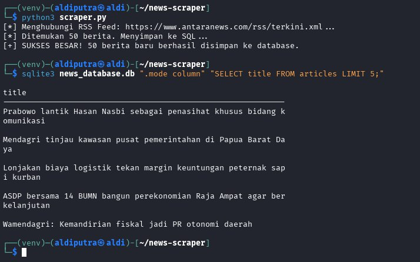

# 📰 Automated News Scraper Pipeline

Proyek ini adalah demonstrasi **Data Pipeline** sederhana yang mengotomatisasi proses pengambilan data (Scraping) dari portal berita, pengolahan data, hingga penyimpanan ke dalam database relasional.

### 🚀 Fitur Utama:
- **Data Extraction:** Mengambil data berita secara real-time melalui RSS Feed resmi.
- **Data Persistence:** Menyimpan data secara terstruktur ke dalam **SQLite3**.
- **Data Integrity:** Dilengkapi fitur pengecekan duplikasi data (duplicate check) berdasarkan URL.
- **Containerization:** Aplikasi siap dideploy di lingkungan mana pun menggunakan **Docker**.

### 🛠️ Tech Stack:
- **Language:** Python 3.11
- **Libraries:** BeautifulSoup4, Requests, LXML
- **Database:** SQLite3
- **DevOps/Infrastructure:** Docker, Linux CLI (Kali Linux)

### 📊 Bukti Eksekusi (Proof of Work)
Berikut adalah hasil pengujian skrip di lingkungan Linux yang menunjukkan pengambilan 50 data berita dan verifikasi penyimpanan di database:



> **Note:** Screenshot di atas menunjukkan proses ETL (Extract, Transform, Load) berhasil dijalankan dan data dapat dipanggil melalui query SQL.

### ⚙️ Cara Menjalankan:

**1. Menggunakan Python Lokal:**
```bash
pip install -r requirements.txt
python3 scraper.py
```

**2. Menggunakan Docker:**
```bash
docker build -t news-scraper .
docker run news-scraper
```

### 📂 Struktur Data:
Tabel `articles` menyimpan informasi:
- `title`: Judul Berita
- `link`: URL Sumber
- `pub_date`: Tanggal Publikasi
- `scraped_at`: Timestamp pengambilan data
